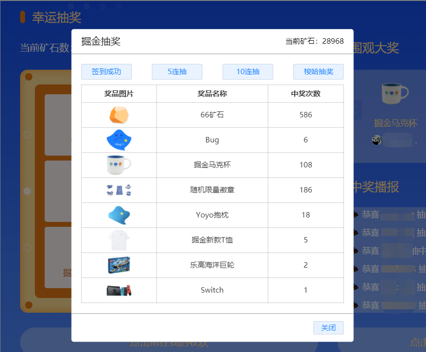

## 油猴脚本

### 程序员就该用程序解决问题

掘金抽奖签到脚本，抽奖可视化
使用petite-vue做的可视化，api可参考使用petite-vue的文档。

功能：
- [x] 签到并自动免费抽奖
- [x] 5连抽
- [x] 10连抽
- [x] 梭哈抽奖

使用方法：
1. 前往 [安装地址](https://greasyfork.org/zh-CN/scripts/431740-%E6%8E%98%E9%87%91%E6%8A%BD%E5%A5%96) 安装使用
2. 打开油猴新建油猴脚本，复制 Juejin_Helper.js 内容到油猴编辑器内，打开掘金即可看到打开抽奖脚本弹窗的按钮。

`支持的朋友可以给个star`

脚本预览：

## 特别声明

**1. 本仓库发布的脚本及其中涉及的任何解锁和解密分析脚本，仅用于测试和学习研究，禁止用于商业用途，不能保证其合法性，准确性，完整性和有效性，请根据情况自行判断。**

**2. 本人对任何脚本问题概不负责，包括但不限于由任何脚本错误导致的任何损失或损害。**

**3. 间接使用脚本的任何用户，建立 VPS 或在某些行为违反国家/地区法律或相关法规的情况下进行传播，本人对于由此引起的任何隐私泄漏或其他后果概不负责。**

**4. 请勿将本仓库的任何内容用于商业或非法目的，否则后果自负。**

**5. 如果任何单位或个人认为该项目的脚本可能涉嫌侵犯其权利，则应及时通知并提供身份证明、所有权证明，我们将在收到认证文件后删除相关脚本。**

**6. 任何以任何方式查看此项目的人或直接或间接使用该项目的任何脚本的使用者都应仔细阅读此声明。本人保留随时更改或补充此免责声明的权利。一旦使用并复制了任何相关脚本或 Script 项目的规则，则视为您已接受此免责声明。**

**7. 您必须在下载任何内容后的 24 小时内从您的存储设备中完全删除下载的内容。**

**8. 您使用或者复制了本仓库和本人制作的任何脚本，则视为 `已接受` 此声明，请仔细阅读，谢谢！**

**9. 本仓库脚本和打包的插件仅用于学习和测试，也请在完成之前，仔细阅读特别声明，完成后，删除脚本和插件，谢谢！**
